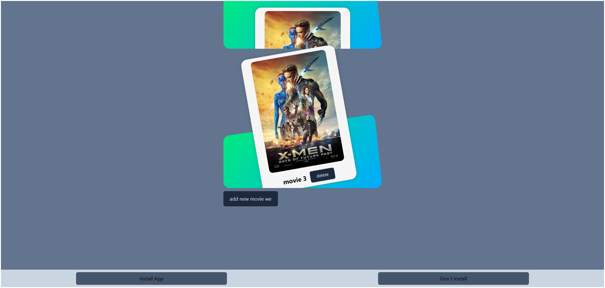

# 🚀 React PWA: Installable Movie App

A progressive web app (PWA) built with **React**, designed to showcase a movie list and allow users to install the app like a native one.

<p align="center">
  
  
  
</p>

---

## 📸 Preview



---

## ✨ Features

- ✅ Built with **React + Vite**
- ✅ **Redux Toolkit** for state management
- ✅ Shows a list of movies
- ✅ Users can delete and add movies
- ✅ **Install prompt** via `beforeinstallprompt` event
- ✅ **Custom PWA UI** to trigger installation
- ✅ Fully responsive with Tailwind CSS

---

## 📲 Install as App (PWA)

This project supports **Progressive Web App** features:

1. Open the app in your browser (mobile or desktop)
2. If the app is installable, a custom banner will appear
3. Click **Install** → The app will be added to your device
4. Works offline after first load (thanks to service worker)

---

## 🔧 Getting Started

```bash
# 1. Clone the repo
git clone https://github.com/amirazadehranjbar/PWA_App_One.git

# 2. Navigate to project directory
cd YOUR_PROJECT_NAME

# 3. Install dependencies
npm install

# 4. Run the app locally
npm run dev
